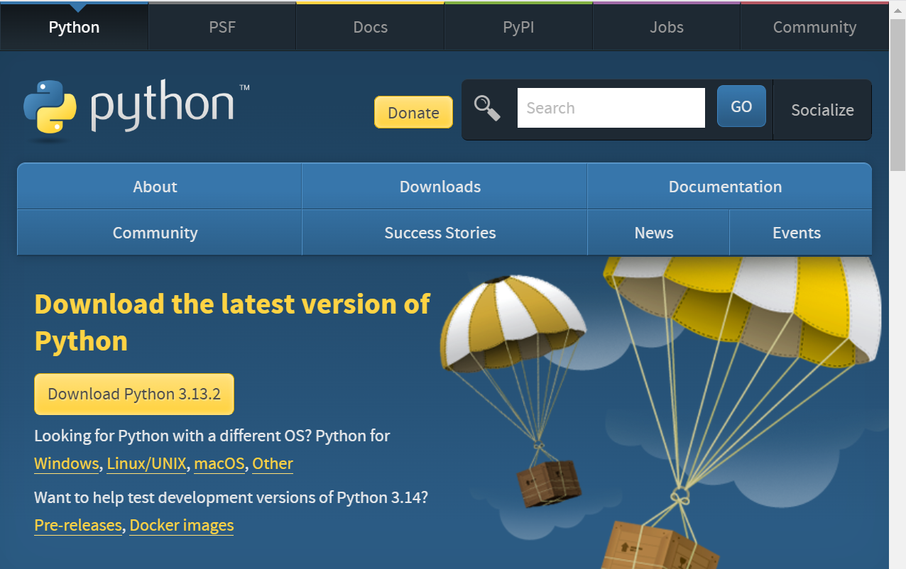
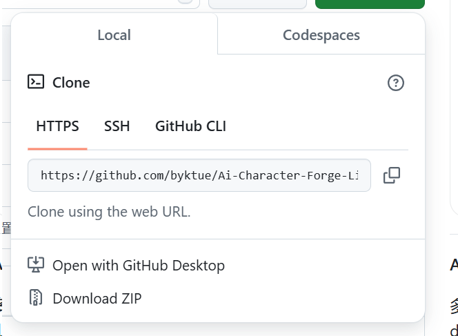
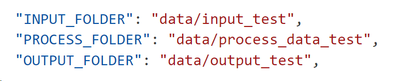
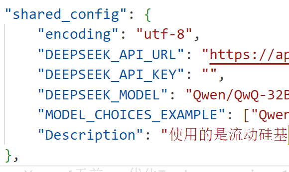
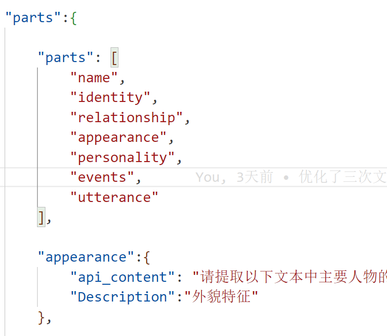

# Ai-Character-Forge-Line 1.3.2.

  

**AI-Powered Character Persona Extraction & Simulation Toolkit**

  

  

多次、多线程调用现有的ai模型，比如deepseek，根据已有文本，批量化、精细化、精准化生成人设

  

Repeatedly and multi-threadedly call the existing AI model (DeepSeek) to generate character personas in a batch, refined, and precise manner based on the provided text.

  
  

[](https://www.python.org/)

  

## 🚀 项目概述

  

**Ai-Character-Forge-Line** 是一个用于处理文本信息，提取文本中主要人物相关信息（如角色身份、性格特点、话语信息等）的项目。该项目通过调用 DeepSeek API 来完成信息提取，并将处理结果保存到指定的输出文件夹中。

  

## ✨ 项目作者

  

#### 项目主要作者：byktue

  

- 所在学校：华东师范大学

- 所在院系与专业：数据科学与工程学院  数据科学与大数据

  

**联系方式：**

- 邮箱： yangbyktue@gmail.com

    10235501403@stu.ecnu.edu.cn

    228900195@qq.com

- 微信：wx228900195

- QQ：228900195

  

##### 项目合作者：duringbug

  
  

## 🚀 使用流程

**现已开发完成了自动化工作流**


#### 本地部署

1. 下载python https://www.python.org/downloads/
    
	
2. 将项目下载到本地，可以通过git 拉取或是fork拉取分支，也可以直接下载压缩包
    


#### config配置

**配置文件位于src/config/config.json**

1. 输入和输出文件地址配置：（使用相对位置）
    输入文件夹：在"INPUT_FOLDER"，后面的双引号中填入输入文件所在地址
    过程数据存储文件夹："PROCESS_FOLDER"
    输出文件夹："OUTPUT_FOLDER"

    


2. 寻找到"shared_config"，选择模型，配置api_key
    （不一定就要用DEEPSEEK的，千问的也行，至于没什么这里还带有DEEPSEEK的前缀，是因为好多文件中都用到了这个配置，我懒得改了）
    在"DEEPSEEK_API_URL"中填写对应的api_url，（如果不知道这是什么，可以去问问豆包）
    在"DEEPSEEK_API_KEY"中填写对应的api_key
    在"DEEPSEEK_MODEL"中填写模型名称，选择使用的模型

    


3. "parts"，多线程处理模块设置
    其中的"parts"的集合中元素的顺序，影响到最终生成文本时的对应版块排列顺序
    而下面对应的每个小版块，其中的"api_content",是拉取api请求时对应线程的详细预设提示词，"Description"是简略的描述

    


#### 程序运行

1. 将要处理的剧本（pdf图片）放入之前所配置的config.json文件中"INPUT_FOLDER"对应的文件夹

2. 在src/drama_list.txt中，按照"剧本名称 人物名称"的格式（剧本名称和人物名称中间用空格作为间隔），填写需要生成的人设列表，如果当前运行时不想生成人设，也可以只写剧本名称，相应输出可以在data/prcess_data/combination中找到（二次文本处理后的剧本总结）

3. 运行src/main.py文件，可以在编译器中运行，也可以右键本项目的根目录所在文件夹，选择"在终端打开"，输入 pyhton src/main.py


#### 主要代码版块

1. 本地预处理，pdf转txt（src/local_preprocessing）
    因为网络上的剧本杀资源大多是以pdf格式进行存储，所以会先对文件进行转写

2. 初次文本处理（src/Text_summaries_1）
    通过不同维度（姓名，外貌，事件等），对文本内容进行多线程并行处理，借助原本的文件结构作为文本划分，降维并总结，并保持原本的文件结构

3. 二次文本处理（src/Text_summaries_2）
    将初次文本处理的结果进行汇总，即同一线程下的文件夹中的所有输出，全部汇总到一个对应的文件中，比如对应events文件夹，则将输出全部汇总到events.txt文件

4. 三次文本处理（src/Text_summaries_3）
    根据剧本人物名称，阅读二次文本处理汇总后的文件，按照特定模板，生成对应人设


## ✨ 项目实现功能


- **pdf转txt**：网络上剧本杀的文本素材大多以pdf存储，在本地预处理将pdf转为txt，有利于后续操作减少成本


- **批量多线程处理**：Text summaries_1 文件夹中，在对长文本进行多线程降维处理时，已实现程序并行


- **精准细节提取**：结合规则引擎与DeepSeek模型，把文本内容总结为角色性格、事件、外貌等多个方面，多线程拉取Deepseek的api进行文本总结处理，确保精细化


- **生成markdown格式的人设**：将多线程处理好的维度进行汇总，按特定格式生成符合的markdown格式的人设


- **自动化工作流**：已初步实现自动化工作流，在src/main.py中，已实现将不同版块的功能连接起来
  


## 🚀 项目结构

  

data 文件夹用于存储数据，src文件夹用于存储代码和配置

  

**配置文件**

- src/config/config.json：包含项目的输入输出文件夹路径、编码方式以及 DeepSeek API 的 URL 等配置信息。

  

**pdf转txt**

- src/local preprocessing/photo_to_txt.py：提取pdf文件中的文本信息，并按原本的文件结构进行存储（保持原本的文件夹嵌套顺序）

  

**初次文本处理**

- 位于src/Text summaries_1

- 划分多个板块拉取deepseek的api进行相应的处理，比如name文件夹中，就是处理相应的名字和别名信息。

- src/Text summaries_1/main.py 文件，则是将多线程并行运行的程序，在初次文本处理时，运行这个程序即可

- 线程中处理的结果，依旧是按照原本的文件结构进行存储

  

**二次文本处理**

- 位于src/Text summaries_2

- 将初次文本处理后的同一类的文件，汇总到一个文本文件中，比如对于events维度进行处理之后，将events初次处理后的文件夹中的所有文件，全部汇聚到一个txt文件中

- 删除空文件和无效信息，比如有些文件因为没有提取到有效的信息，仍会保留着 ”对于文本中角色的话语信息：角色话语：请提供文本内容，我将帮助提取角色的话语。” 之类的无效信息

- 核心代码为src/Text summaries_2/main.py

  

**三次文本处理**

- 位于src/Text summaries_3

-  根据用户输入的人物名称，拉取deepseek的api，对二次文本处理后的不同维度进行处理，进行汇总，形成具有丰富细节的人物人设

- 主代码为src/Text summaries_3/main.py

  

文件结构为

```

|   README.md

|

+---data

\---src

    |   drama_list.txt
    |   install_dependencies.py
    |   main.py
    |   requirements.txt
    |   run_one.py
    |   src.md
    |   __init__.py
    |
    +---config
    |   |   config.json
    |   |   config_loader.py
    |   |
    |   \---__pycache__
    |           config_loader.cpython-313.pyc
    |
    +---local_preprocessing
    |   |   photo_to_txt.py
    |   |
    |   \---__pycache__
    |           photo_to_txt.cpython-313.pyc
    |
    +---Text_summaries_1
    |   |   api_request.py
    |   |   file_processor.py
    |   |   main.py
    |   |
    |   \---__pycache__
    |           api_request.cpython-313.pyc
    |           file_processor.cpython-313.pyc
    |           main.cpython-313.pyc
    |
    +---Text_summaries_2
    |   |   combination.py
    |   |   main.py
    |   |
    |   \---__pycache__
    |           combination.cpython-313.pyc
    |           main.cpython-313.pyc
    |
    +---Text_summaries_3
    |   |   main.py
    |   |   part_sum.py
    |   |
    |   \---__pycache__
    |           main.cpython-313.pyc
    |           part_sum.cpython-313.pyc
    |
    \---__pycache__
            run_one.cpython-313.pyc

```